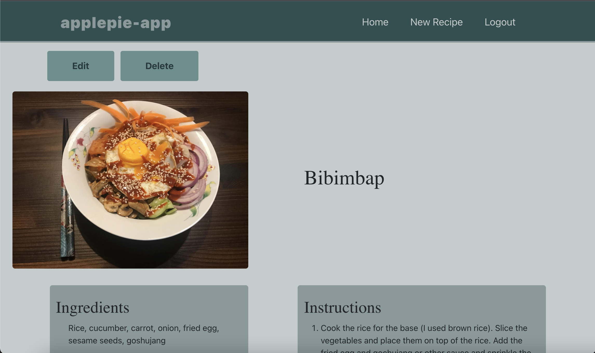

README - applepie_app

This is a work in progress sample recipe application, Rails in the backend, React in the frontend.

The site is not yet deployed. 
Screenshots about the current status of the application:

User registration:

User login:

Home page:

Create new recipe:

Show page for a recipe:

Edit recipe:
